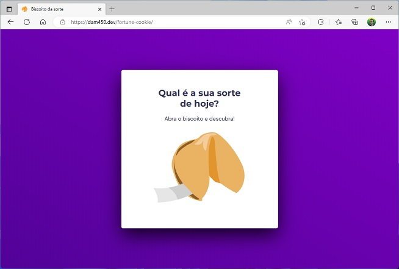

<h1 align="center">Biscoito da sorte</h1>

  <a href="#-deploy">Deploy</a>&nbsp;&nbsp;&nbsp;|&nbsp;&nbsp;&nbsp;
  <a href="#-tecnologias">Tecnologias</a>&nbsp;&nbsp;&nbsp;|&nbsp;&nbsp;&nbsp;
  <a href="#-projeto">Projeto</a>&nbsp;&nbsp;&nbsp;|&nbsp;&nbsp;&nbsp;
  <a href="#-layout">Layout</a>&nbsp;&nbsp;&nbsp;|&nbsp;&nbsp;&nbsp;

  

## 🚀 Deploy

 
  

O projeto está hospedado no Github Pages e pode ser acessado através do link [dam450.github.io/fortune-cookie](https://dam450.github.io/fortune-cookie/).

## 🦾 Tecnologias

Esse projeto foi desenvolvido com as seguintes linguagens e recursos:

  

- HTML 
    - Estruturas semânticas
- CSS
    - Animações CSS
- Javascript
    - Funções, Callback e eventListeners
    - Manipulação da DOM
    - Biblioteca JS Math()
    - Arrays

## 💻 Projeto

Neste projeto o desafio foi criar um jogo chamado Biscoito da Sorte, no qual o usuário, **a partir de um clique ou enter**, abre um biscoito com a sua sorte do dia.

## 🔖 Layout

Para visualizar o layout **Figma** criado para esse projeto clique [AQUI](https://www.figma.com/file/u9cH9NesFCAtjUYNFWkdjh/Biscoito-da-Sorte-(Community)?node-id=0%3A1&viewer=1).

## :memo: Licença

Esse projeto está sob a licença [MIT](./license.md).

---

Feito com ♥ by [Dam450](https://github.com/dam450/)
